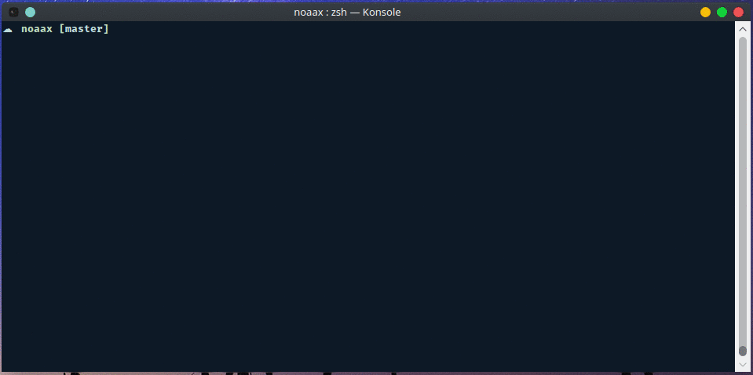

# Noaax

> Fetch weather information from a NOAA station

[](https://travis-ci.org/nayed/noaax)
[](http://inch-ci.org/github/nayed/noaax)

## Usage
```console
$ bin/noaax <station>

Options:
-s, --state <state>       show stations available in the <state>

    example:
    $ bin/noaax -s ca     will display station available in California

-h, --help                show this help message
-v, --version             show noaax version
```



## Installation
Assuming you have [elixir](http://elixir-lang.org) install:
```console
$ git clone https://github.com/nayed/noaax.git
$ cd gissues
$ mix deps.get
$ mix escript.build
```

This will create the `noaax` executable file in the `bin` directory

### Documentation
[API documentation](https://nayed.github.io/noaax/doc/)
